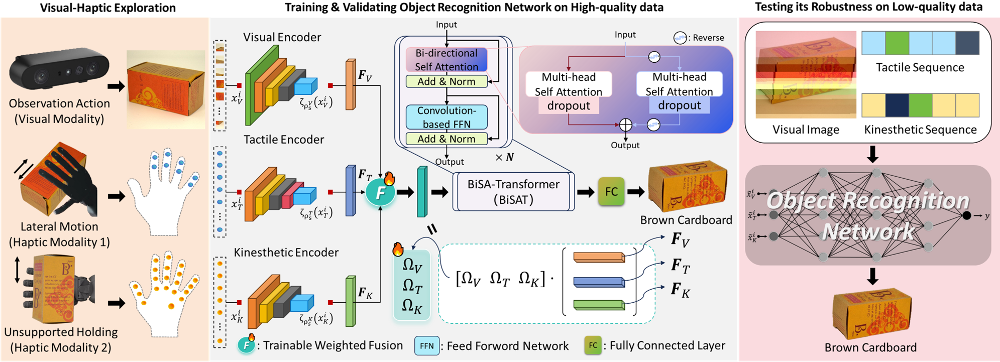

# 🏭 RobustVisH: Robust Visual-Haptic Cross-Modal Recognition Under Transmission Interference (ACM MM 2025)



**Status**: Supplementary materials for the manuscript *"RobustVisH: RobustVisual-Haptic Cross-Modal Recognition Under Transmission Interference"*.

## 📁 Repository Structure
```bash
.
├── README.md          # You are here
├── requirements-RobustVisH.txt   # Python dependencies
├── requirements-WITIM.txt     # Python dependencies for WITIM benchmark
├── hello.png          # Model overview image
├─ RobustVisH/        # RobustVisH model implementation
│  ├── lib/               # Core implementation
│  │    ├── models/          # Model architectures
│  │    │    └── cnnBiGRUbisa.py        # Main model definition
│  │    └── data/              # Data processing scripts & sample dataset
│  │         ├── RegNet_Y_32GF.py
│  │         └── DataLoader.py              # Dataset loader
│  ├── weights/       # Pre-trained models
│  │    ├── RobustVisH-AU.h5          # Pre-trained on Action Unit dataset
│  │    └── RobustVisH-PHAC-2.h5      # Pre-trained on PHAC-2 dataset
│  ├── clr_callback.py            # Learning rate scheduler
│  ├── model_test.py              # Evaluation pipeline
│  └── model_train.py             # Training pipeline
└─ WITIM/            # WIreless Transmission Interference-based Multi-modal benchmark
    ├── gmsk_haptic.grc
    ├── gmsk_haptic.py
    ├── gmsk_visual.grc
    ├── gmsk_visual.py
    ├── haptic_batch_run.bat
    ├── visual_batch_run.bat
    └── WITIM.png
```

## 🚀 Quick Start
1. Environment Setup
```bash
# Create conda environment (recommended)
conda create -n RobustVisH python=3.8
conda activate RobustVisH
# Install dependencies
pip install -r requirements for RobustVisH.txt
```

2. Data Preparation
```bash
# 1. Download dataset and use WITIM
# 2. Preprocess data
python RobustVisH/lib/data/RegNet_Y_32GF.py
```
3. Model Training
```bash
python RobustVisH/model_train.py
```
4. Inference
```bash
python RobustVisH/model_test.py
```

## 🔮 Pre-trained Models
| Dataset | Accuracy | F1-score | Model Checkpoint |
|---------|----------|----------|------------------|
| AU      | 91.11%   | 0.9061   | RobustVisH/weights/RobustVisH-AU.h5 |
| PHAC-2  | 61.81%   | 0.6210   | RobustVisH/weights/RobustVisH-PHAC-2.h5 |

## 📜 Citation
If you find this work useful, please cite our preprint:
```bibtex
@inproceedings{RobustVisH2025,
  title={RobustVisH: Robust Visual-Haptic Cross-Modal Recognition Under Transmission Interference},
  author={Zhang, Rouqi and Lu, Chengdi and Lu, Hancheng and Cao, Yang and Zhao, Tiesong},
  booktitle={Proceedings of the 33rd ACM International Conference on Multimedia (MM'25)},
  year={2025},
  url={https://openreview.net/forum?id=v1v7zRmL3o}
}
```

## ⚠️ Important Notes
**Hardware Requirements**: Recommended NVIDIA RTX2080Ti or better GPU for training.
