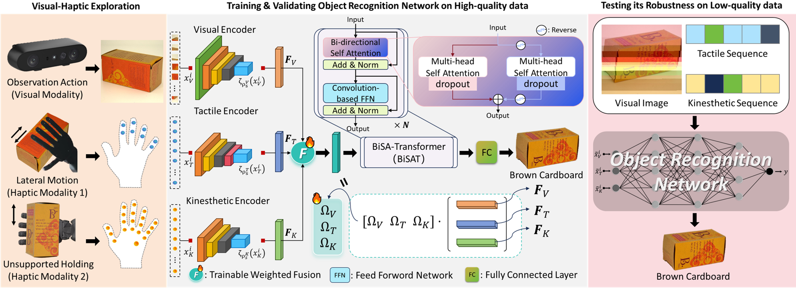

# 🏭 RobustVisH: Robust Visual-Haptic Cross-Modal Recognition Under Transmission Interference (ACM MM 2025)



**Status**: Supplementary materials for the manuscript *"RobustVisH: RobustVisual-Haptic Cross-Modal Recognition Under Transmission Interference"*.

## 📁 Repository Structure
```bash
.
├── README.md          # You are here
├── requirements-RobustVisH.txt   # Python dependencies
├── requirements-WITIM.txt     # Python dependencies for WITIM benchmark
├── hello.png          # Model overview image
├─ RobustVisH/        # RobustVisH model implementation
│  ├── lib/               # Core implementation
│  │    ├── models/          # Model architectures
│  │    │    └── cnnBiGRUbisa.py        # Main model definition
│  │    └── data/              # Data processing scripts & sample dataset
│  │         ├── RegNet_Y_32GF.py
│  │         └── DataLoader.py              # Dataset loader
│  ├── weights/       # Pre-trained models
│  │    ├── RobustVisH-AU.h5          # Pre-trained on Action Unit dataset
│  │    └── RobustVisH-PHAC-2.h5      # Pre-trained on PHAC-2 dataset
│  ├── clr_callback.py            # Learning rate scheduler
│  ├── model_test.py              # Evaluation pipeline
│  └── model_train.py             # Training pipeline
└─ WITIM/            # WIreless Transmission Interference-based Multi-modal benchmark
    ├── gmsk_haptic.grc
    ├── gmsk_haptic.py
    ├── gmsk_visual.grc
    ├── gmsk_visual.py
    ├── haptic_batch_run.bat
    ├── visual_batch_run.bat
    └── WITIM.png
```

## 🚀 Quick Start
1. Environment Setup
```bash
# Create conda environment (recommended)
conda create -n RobustVisH python=3.8
conda activate RobustVisH
# Install dependencies
pip install -r requirements for RobustVisH.txt
```

2. Data Preparation
```bash
# 1. Download dataset and use WITIM
# 2. Preprocess data
python RobustVisH/lib/data/RegNet_Y_32GF.py
```
3. Model Training
```bash
python RobustVisH/model_train.py
```
4. Inference
```bash
python RobustVisH/model_test.py
```

## 🔮 Pre-trained Models
| Dataset | Accuracy | F1-score | Model Checkpoint |
|---------|----------|----------|------------------|
| AU      | 91.11%   | 0.9061   | RobustVisH/weights/RobustVisH-AU.h5 |
| PHAC-2  | 61.81%   | 0.6210   | RobustVisH/weights/RobustVisH-PHAC-2.h5 |

## 📜 Citation
The electronic version of the paper is now available and can be downloaded by searching for "RobustVisH" in ACM Library. If you find this work useful, please refer to "RobustVisH" in the following ways:
```bibtex
@inproceedings{10.1145/3746027.3754859,
author = {Zhang, Rouqi and Lu, Chengdi and Lu, Hancheng and Cao, Yang and Zhao, Tiesong},
title = {RobustVisH: Robust Visual-Haptic Cross-Modal Recognition under Transmission Interference},
year = {2025},
isbn = {9798400720352},
publisher = {Association for Computing Machinery},
address = {New York, NY, USA},
url = {https://doi.org/10.1145/3746027.3754859},
doi = {10.1145/3746027.3754859},
abstract = {Embodied AI calls for a reliable, cross-modal object recognition that deeply mines High-Quality (HQ) object appearance (i.e., visual information) and touch details (i.e., haptic information). While in real-world scenarios, cross-modal data is usually degraded due to data acquisition and delivery in complex environments. In this paper, we propose a Robust Visual-Haptic recognition (RobustVisH) model that identifies Low-Quality (LQ) visual-haptic data with transmission distortion for the first time. First, we introduce the WIreless Transmission Interference-based Multi-modal benchmark (WITIM) as a visual-haptic dataset under transmission interference. In particular, the dataset consists of WITIM/AU and WITIM/PHAC-2, in which the original signals are obtained from AU and PHAC-2, respectively. Second, we design a trainable weighted fusion and a Transformer encoder based on the bi-directional self-attention mechanism, enabling RobustVisH to form and learn fused visual-haptic features after modality-specific one-dimensional feature encoding. Third, we employ a covariate shift paradigm, transferring knowledge of RobustVisH from HQ data to LQ data, thereby increasing its robustness against transmission-interference inputs. Experimental results demonstrate that the proposed RobustVisH improves the accuracy of the state-of-the-art method by 2.06\% and 9.28\% on WITIM/AU and WITIM/PHAC-2, respectively. Source code is available at: https://github.com/lylibylily/RobustVisH.},
booktitle = {Proceedings of the 33rd ACM International Conference on Multimedia},
pages = {92–100},
numpages = {9},
keywords = {covariate shift, embodied ai, gnu radio, industrial intelligence, kinesthetic, ood generalization, tactile, wireless transmission},
location = {Dublin, Ireland},
series = {MM '25}
}
}
```

## ⚠️ Important Notes
**Hardware Requirements**: Recommended NVIDIA RTX2080Ti or better GPU for training.

